# SpiderMind architecture: Phases 1 to 3

## Lifecycle and boundaries

1. `POST /api/v1/crawl` validates the Pydantic request, normalizes and checks the start URL, persists a `PENDING` job, and schedules an in-process task.
2. The task marks the job `RUNNING` and inserts the start URL into the selected frontier. The seed is always crawled first and has no predicted link score. Frontier items hold URL, normalized URL, depth, parent, discovery time/order, link context, predicted relevance, and priority.
3. For each item, the crawler writes a `QUEUED` page, checks cached robots policy, moves to `FETCHING`, then asks the fetcher for a bounded HTML response. The fetcher checks the target and each redirect, applies shared per-domain spacing, validates status and content type, and streams only up to `max_content_size`.
4. The parser extracts metadata, readable text, and links. It captures links before removing navigation and footer elements from text extraction. Trafilatura supplies main text, with a BeautifulSoup fallback.
5. The crawler hashes normalized text. A repeated hash yields `SKIPPED` and `duplicate_of_page_id`; the repeated text is omitted. Other parsed pages become `COMPLETED`. All extracted HTTP links are stored in `discovered_links`, including external links. The link scheduler records eligibility and, in intelligent mode, scores eligible candidates as one batch per page before admitting them to the frontier.
6. Per-page fetch/parse errors become `FAILED` without ending the job. Robots denials, out-of-scope links, depth exclusions, duplicate content, and leftover frontier items at `max_pages` count as skipped. The job ends `COMPLETED` when traversal finishes, or `FAILED` on a job-wide timeout or unexpected orchestration error.

The API status counters are committed during the crawl. A job may be `COMPLETED` with failed pages; the job status describes orchestration, while page status describes each URL. JSON log records include `job_id` and event names without page bodies.

## Why components are separate

- **Normalizer:** One identity for equivalent HTTP URLs, relative links, fragments, host casing, default ports, and redundant trailing slashes. Unsupported schemes are rejected before frontier admission.
- **Frontiers:** `Frontier` preserves FIFO/BFS. `PriorityFrontier` orders scored items and implements deterministic exploration. Neither has HTTP, database, parsing, or embedding knowledge.
- **Target validator:** Rejects local, private, link-local, and other non-global IP literals and DNS answers. Every HTTP redirect is checked. The client does not inherit proxy settings.
- **Fetcher:** Owns async HTTP behavior, transient retries (429 and common 5xx plus network errors), redirect count, size and type validation, and response metrics. Permanent 4xx errors are not retried.
- **Robots manager:** Parses rules for the configured user-agent and caches them per origin. Missing policy (404/410) allows access; other retrieval failures deny access. Redirect targets are checked against scope and robots before fetching.
- **Rate limiter:** Uses a per-domain lock and next-allowed timestamp shared by all jobs in one process. This permits future domain-specific intervals, robots crawl-delay, and multiple domains in flight without changing the fetcher API.
- **Parser:** Builds structured metadata and links, including a bounded nearby paragraph/list/parent context. Internal/external classification compares exact hostnames with the start host.
- **Link scheduler:** Applies depth, domain, duplicate, private-address, and optional relevance filters; batches candidates through the scorer; records each decision and admits selected items to the frontier.
- **Embedding provider and scorer:** The provider owns one reusable local Sentence Transformers model; the scorer builds bounded candidate/page representations, caches a query vector per job, batches candidate embeddings, computes cosine similarity, and applies the depth penalty.
- **Deduplicator:** SHA-256 of whitespace-normalized, case-folded extracted text prevents duplicate text records. The original page ID remains queryable.
- **Repository and SQLAlchemy models:** Jobs, pages, and link edges remain distinct. `source_page_id`, normalized target, and indexes provide a straightforward future knowledge-graph import path.

## Limits and recovery

`max_depth` controls which discovered links enter the frontier. `max_pages` limits popped items, including skipped and failed attempts. `timeout` is an overall job deadline. `max_content_size` is checked from `Content-Length` where available and while streaming. A redirect cannot leave the configured crawl scope. A startup recovery pass marks abandoned `PENDING` and `RUNNING` jobs as `FAILED`. The API uses one process; running multiple Uvicorn workers would not share task state or rate-limit clocks.

The database uses async SQLAlchemy with SQLite/aiosqlite. SQLite I/O is mediated through a background thread; this is appropriate for local development but is not a high-throughput distributed queue. Phase 2 includes an idempotent, additive SQLite migration for existing Phase 1 files. A full migration tool is needed for future destructive or relational schema changes. A future worker queue should replace the in-process task set and add resume/checkpoint semantics.

## FIFO and intelligent flows

FIFO remains the request default, including when no `crawl_mode` field is sent. Its scheduler checks scope and depth and admits eligible links in discovery order. An optional `research_query` on a FIFO job enables page-level relevance measurement without changing the ordering.

Intelligent mode requires a query. The scorer embeds it once per job; the provider loads BGE-M3 once per API process and reuses it. Each parsed page supplies its eligible links as one batch. Exact candidate representations are cached per job to avoid repeat embedding work. Out-of-scope and depth-excluded links are stored with rejection reasons but not embedded.

```text
 Research query ──> one query embedding ────────────────────────────┐
                                                                    │
 Page ──> parser ──> links + bounded nearby text                   │
                       │                                            │
                       v                                            │
             candidate representations ──> batch embeddings ──> cosine
                                                             │
                                                             v
                                                    depth-aware priority
                                                             │
                                                             v
                                                   priority frontier
                                                             │
                                                             v
                                                          crawler
```

Candidate text contains target URL (up to 500 characters), anchor (200), source title (200), and nearby text (default 280). Page-level outcome scoring embeds title, description, and at most 1,200 content characters after fetching. It is recorded for evaluation and does not alter decisions already made.

For nonzero vectors, `relevance_score = dot(query, candidate) / (norm(query) × norm(candidate))`, bounded to `[-1, 1]`. This is a similarity, not a probability. `priority_score = relevance_score - depth × depth_penalty`; the default penalty is `0.02`. The optional threshold compares **raw relevance** before depth penalty. A score below it receives `LOW_RELEVANCE` and remains visible through `/links`.

The priority frontier pops higher priority first, then shallower depth, then earlier discovery order. With the default exploration rate `0.10`, every tenth pop takes the lowest-priority remaining eligible item if more than one exists. This is deterministic, not random. The threshold remains a hard cutoff; exploration cannot revive a rejected link. The seed bypasses score and threshold. External links remain persisted but enter neither frontier unless external domains are enabled and all other scope rules pass.

The job records mode, query, model, threshold, penalty, exploration rate, scoring counts/times, and score aggregates. Each discovered link records title/context, score, priority, penalty, scoring status, selection, and rejection reason. Each crawled page records predicted link relevance and actual post-fetch page relevance. This is deterministic explainability metadata; no LLM produces explanations.

The evaluation utility compares completed jobs with the same query, seed, scope, depth, and page budget. `relevant_page_yield = relevant completed pages / completed pages`. When fixture labels are supplied, relevance comes from those independent labels; otherwise it uses a declared page-score threshold. `mean_page_relevance = sum(actual page cosine scores) / completed pages`. `high_relevance_hit_rate = pages with actual score ≥ high_threshold / completed pages`. `crawl_efficiency = relevant completed pages / requested max_pages`. Zero denominators yield zero. A controlled fixture and measured output are in `backend/tests/fixtures/research_site` and `docs/phase2-demo-results.json`.

## Phase 3 research flow

```mermaid
flowchart LR
    Q[Question] --> P[Ollama planner + Pydantic schema]
    P --> SQ[Subquestions and deduplicated queries]
    SQ --> S[DDGS search provider]
    S --> V[Normalize URL + public target validation]
    V --> R[Unique result pool + query associations]
    R --> E[BGE-M3 semantic scores]
    E --> D[Deterministic rank and domain selection]
    D --> C[Sequential bounded Phase 2 intelligent crawls]
    C --> DB[(SQLite provenance and page outcomes)]
```



`POST /api/v1/research` persists a `pending` job and returns HTTP 202 before planning. The background service plans once from the original question, validates the structured JSON response, searches each unique query once, and retains the many-to-many query/subquestion and result/query relationships. The planner gets no snippets or page content. Malformed/private results are rejected before persistence or crawling. Search calls are bounded by `max_concurrent_searches` and retry a limited number of times. An individual failed query is recorded; remaining queries continue.

For each subquestion, the service embeds its question and each unique result representation (bounded title, snippet, URL) with the same BGE-M3 provider used by Phase 2. Cosine is mapped to `[0,1]`, combined with the reciprocal-log search-rank prior using configurable semantic weight (default `0.85`), then sorted by descending score and URL as a deterministic tie-breaker. The default domain cap is one selected seed per domain per subquestion. All candidates retain their cosine, combined score, selection, and rejection reason. A URL can be relevant to multiple subquestions, with one seed row per association.

The orchestrator submits each selected public seed as an existing intelligent crawl with its subquestion as `research_query`. It runs crawls sequentially so actual page attempts can be counted before allocating the next budget. Global and per-subquestion limits bound the next crawl's `max_pages`; failed and robots-denied attempts consume slots. The same selected seed URL is crawled once, and previously fetched URLs are skipped by later research crawls. Distinct crawl jobs retain their own Phase 2 page/link provenance. This avoids repeat fetching across completed crawls; the skipped URL can still consume one attempted slot when it is discovered in a later frontier. Multiple Uvicorn processes do not coordinate these in-memory deduplication sets.

Tables `research_jobs`, `research_subquestions`, `research_search_queries`, `research_query_subquestions`, `research_search_results`, `research_result_occurrences`, and `research_seeds` store a path from question to subquestion to query to result to seed to crawl job to page. Existing Phase 1/2 tables and endpoints remain. The additive SQLite startup migration creates the new tables and sets schema version 3. A full relational migration framework is still future work. `/plan`, `/searches`, and `/sources` expose persisted decisions without final answer synthesis.

The deterministic evaluation helper uses human-labeled high-level facet aliases and source/page URL labels. Facet coverage is matched alias count divided by expected facets. Subquestion redundancy and query diversity use pairwise token Jaccard overlap at `0.8`. Seed precision at K uses labeled relevant selected seeds divided by selected seeds; domain ratio uses unique domains divided by selected seeds. It also reports selected/rejected cosine distributions, relevant crawled-page count, mean page cosine, and attempted-page budget utilization. These metrics describe the fixture, not general accuracy. Benchmarks are in `backend/tests/fixtures/phase3_benchmarks.json`.

Phase 3 deliberately stops after source collection. It has no answer generator, claim verifier, vector database, RAG index, autonomous loop, LangGraph workflow, or frontend.

## Security and operational limits

The validator resolves public hosts before requests, but HTTPX resolves again when connecting; DNS rebinding between those steps is still possible. A production deployment with untrusted users should pin resolved addresses at connection time and enforce outbound firewall rules. Subdomains are distinct hosts. The crawler does not process JavaScript-rendered content, canonical URLs as crawl identity, sitemaps, authentication, or robots crawl-delay directives. Public-site policies and terms remain the operator's responsibility.
