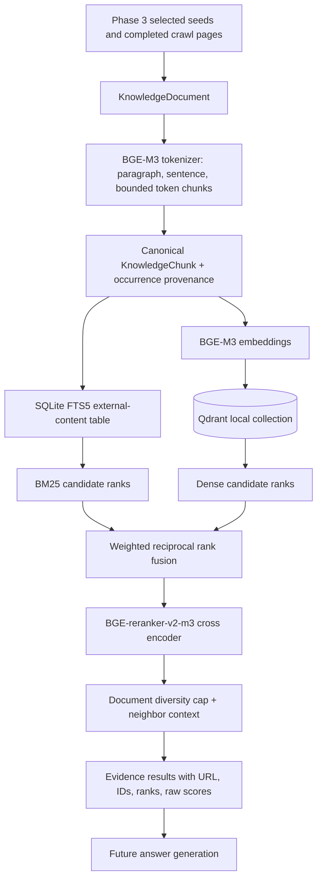
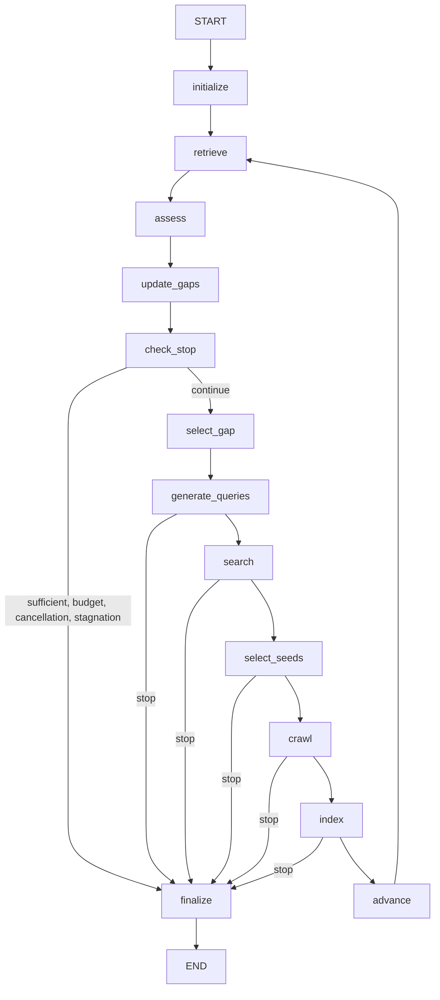

# SpiderMind architecture: Phases 1 to 5

## Lifecycle and boundaries

1. `POST /api/v1/crawl` validates the Pydantic request, normalizes and checks the start URL, persists a `PENDING` job, and schedules an in-process task.
2. The task marks the job `RUNNING` and inserts the start URL into the selected frontier. The seed is always crawled first and has no predicted link score. Frontier items hold URL, normalized URL, depth, parent, discovery time/order, link context, predicted relevance, and priority.
3. For each item, the crawler writes a `QUEUED` page, checks cached robots policy, moves to `FETCHING`, then asks the fetcher for a bounded HTML response. The fetcher checks the target and each redirect, applies shared per-domain spacing, validates status and content type, and streams only up to `max_content_size`.
4. The parser extracts metadata, readable text, and links. It captures links before removing navigation and footer elements from text extraction. Trafilatura supplies main text, with a BeautifulSoup fallback.
5. The crawler hashes normalized text. A repeated hash yields `SKIPPED` and `duplicate_of_page_id`; the repeated text is omitted. Other parsed pages become `COMPLETED`. All extracted HTTP links are stored in `discovered_links`, including external links. The link scheduler records eligibility and, in intelligent mode, scores eligible candidates as one batch per page before admitting them to the frontier.
6. Per-page fetch/parse errors become `FAILED` without ending the job. Robots denials, out-of-scope links, depth exclusions, duplicate content, and leftover frontier items at `max_pages` count as skipped. The job ends `COMPLETED` when traversal finishes, or `FAILED` on a job-wide timeout or unexpected orchestration error.

The API status counters are committed during the crawl. A job may be `COMPLETED` with failed pages; the job status describes orchestration, while page status describes each URL. JSON log records include `job_id` and event names without page bodies.

## Why components are separate

- **Normalizer:** One identity for equivalent HTTP URLs, relative links, fragments, host casing, default ports, and redundant trailing slashes. Unsupported schemes are rejected before frontier admission.
- **Frontiers:** `Frontier` preserves FIFO/BFS. `PriorityFrontier` orders scored items and implements deterministic exploration. Neither has HTTP, database, parsing, or embedding knowledge.
- **Target validator:** Rejects local, private, link-local, and other non-global IP literals and DNS answers. Every HTTP redirect is checked. The client does not inherit proxy settings.
- **Fetcher:** Owns async HTTP behavior, transient retries (429 and common 5xx plus network errors), redirect count, size and type validation, and response metrics. Permanent 4xx errors are not retried.
- **Robots manager:** Parses rules for the configured user-agent and caches them per origin. Missing policy (404/410) allows access; other retrieval failures deny access. Redirect targets are checked against scope and robots before fetching.
- **Rate limiter:** Uses a per-domain lock and next-allowed timestamp shared by all jobs in one process. This permits future domain-specific intervals, robots crawl-delay, and multiple domains in flight without changing the fetcher API.
- **Parser:** Builds structured metadata and links, including a bounded nearby paragraph/list/parent context. Internal/external classification compares exact hostnames with the start host.
- **Link scheduler:** Applies depth, domain, duplicate, private-address, and optional relevance filters; batches candidates through the scorer; records each decision and admits selected items to the frontier.
- **Embedding provider and scorer:** The provider owns one reusable local Sentence Transformers model; the scorer builds bounded candidate/page representations, caches a query vector per job, batches candidate embeddings, computes cosine similarity, and applies the depth penalty.
- **Deduplicator:** SHA-256 of whitespace-normalized, case-folded extracted text prevents duplicate text records. The original page ID remains queryable.
- **Repository and SQLAlchemy models:** Jobs, pages, and link edges remain distinct. `source_page_id`, normalized target, and indexes provide a straightforward future knowledge-graph import path.

## Limits and recovery

`max_depth` controls which discovered links enter the frontier. `max_pages` limits popped items, including skipped and failed attempts. `timeout` is an overall job deadline. `max_content_size` is checked from `Content-Length` where available and while streaming. A redirect cannot leave the configured crawl scope. A startup recovery pass marks abandoned `PENDING` and `RUNNING` jobs as `FAILED`. The API uses one process; running multiple Uvicorn workers would not share task state or rate-limit clocks.

The database uses async SQLAlchemy with SQLite/aiosqlite. SQLite I/O is mediated through a background thread; this is appropriate for local development but is not a high-throughput distributed queue. Phase 2 includes an idempotent, additive SQLite migration for existing Phase 1 files. A full migration tool is needed for future destructive or relational schema changes. A future worker queue should replace the in-process task set and add resume/checkpoint semantics.

## FIFO and intelligent flows

FIFO remains the request default, including when no `crawl_mode` field is sent. Its scheduler checks scope and depth and admits eligible links in discovery order. An optional `research_query` on a FIFO job enables page-level relevance measurement without changing the ordering.

Intelligent mode requires a query. The scorer embeds it once per job; the provider loads BGE-M3 once per API process and reuses it. Each parsed page supplies its eligible links as one batch. Exact candidate representations are cached per job to avoid repeat embedding work. Out-of-scope and depth-excluded links are stored with rejection reasons but not embedded.

```text
 Research query ──> one query embedding ────────────────────────────┐
                                                                    │
 Page ──> parser ──> links + bounded nearby text                   │
                       │                                            │
                       v                                            │
             candidate representations ──> batch embeddings ──> cosine
                                                             │
                                                             v
                                                    depth-aware priority
                                                             │
                                                             v
                                                   priority frontier
                                                             │
                                                             v
                                                          crawler
```

Candidate text contains target URL (up to 500 characters), anchor (200), source title (200), and nearby text (default 280). Page-level outcome scoring embeds title, description, and at most 1,200 content characters after fetching. It is recorded for evaluation and does not alter decisions already made.

For nonzero vectors, `relevance_score = dot(query, candidate) / (norm(query) × norm(candidate))`, bounded to `[-1, 1]`. This is a similarity, not a probability. `priority_score = relevance_score - depth × depth_penalty`; the default penalty is `0.02`. The optional threshold compares **raw relevance** before depth penalty. A score below it receives `LOW_RELEVANCE` and remains visible through `/links`.

The priority frontier pops higher priority first, then shallower depth, then earlier discovery order. With the default exploration rate `0.10`, every tenth pop takes the lowest-priority remaining eligible item if more than one exists. This is deterministic, not random. The threshold remains a hard cutoff; exploration cannot revive a rejected link. The seed bypasses score and threshold. External links remain persisted but enter neither frontier unless external domains are enabled and all other scope rules pass.

The job records mode, query, model, threshold, penalty, exploration rate, scoring counts/times, and score aggregates. Each discovered link records title/context, score, priority, penalty, scoring status, selection, and rejection reason. Each crawled page records predicted link relevance and actual post-fetch page relevance. This is deterministic explainability metadata; no LLM produces explanations.

The evaluation utility compares completed jobs with the same query, seed, scope, depth, and page budget. `relevant_page_yield = relevant completed pages / completed pages`. When fixture labels are supplied, relevance comes from those independent labels; otherwise it uses a declared page-score threshold. `mean_page_relevance = sum(actual page cosine scores) / completed pages`. `high_relevance_hit_rate = pages with actual score ≥ high_threshold / completed pages`. `crawl_efficiency = relevant completed pages / requested max_pages`. Zero denominators yield zero. A controlled fixture and measured output are in `backend/tests/fixtures/research_site` and `docs/phase2-demo-results.json`.

## Phase 3 research flow

```mermaid
flowchart LR
    Q[Question] --> P[Ollama planner + Pydantic schema]
    P --> SQ[Subquestions and deduplicated queries]
    SQ --> S[DDGS search provider]
    S --> V[Normalize URL + public target validation]
    V --> R[Unique result pool + query associations]
    R --> E[BGE-M3 semantic scores]
    E --> D[Deterministic rank and domain selection]
    D --> C[Sequential bounded Phase 2 intelligent crawls]
    C --> DB[(SQLite provenance and page outcomes)]
```



`POST /api/v1/research` persists a `pending` job and returns HTTP 202 before planning. The background service plans once from the original question, validates the structured JSON response, searches each unique query once, and retains the many-to-many query/subquestion and result/query relationships. The planner gets no snippets or page content. Malformed/private results are rejected before persistence or crawling. Search calls are bounded by `max_concurrent_searches` and retry a limited number of times. An individual failed query is recorded; remaining queries continue.

For each subquestion, the service embeds its question and each unique result representation (bounded title, snippet, URL) with the same BGE-M3 provider used by Phase 2. Cosine is mapped to `[0,1]`, combined with the reciprocal-log search-rank prior using configurable semantic weight (default `0.85`), then sorted by descending score and URL as a deterministic tie-breaker. The default domain cap is one selected seed per domain per subquestion. All candidates retain their cosine, combined score, selection, and rejection reason. A URL can be relevant to multiple subquestions, with one seed row per association.

The orchestrator submits each selected public seed as an existing intelligent crawl with its subquestion as `research_query`. It runs crawls sequentially so actual page attempts can be counted before allocating the next budget. Global and per-subquestion limits bound the next crawl's `max_pages`; failed and robots-denied attempts consume slots. The same selected seed URL is crawled once, and previously fetched URLs are skipped by later research crawls. Distinct crawl jobs retain their own Phase 2 page/link provenance. This avoids repeat fetching across completed crawls; the skipped URL can still consume one attempted slot when it is discovered in a later frontier. Multiple Uvicorn processes do not coordinate these in-memory deduplication sets.

Tables `research_jobs`, `research_subquestions`, `research_search_queries`, `research_query_subquestions`, `research_search_results`, `research_result_occurrences`, and `research_seeds` store a path from question to subquestion to query to result to seed to crawl job to page. Existing Phase 1/2 tables and endpoints remain. The additive SQLite startup migration creates the new tables and sets schema version 3. A full relational migration framework is still future work. `/plan`, `/searches`, and `/sources` expose persisted decisions without final answer synthesis.

The deterministic evaluation helper uses human-labeled high-level facet aliases and source/page URL labels. Facet coverage is matched alias count divided by expected facets. Subquestion redundancy and query diversity use pairwise token Jaccard overlap at `0.8`. Seed precision at K uses labeled relevant selected seeds divided by selected seeds; domain ratio uses unique domains divided by selected seeds. It also reports selected/rejected cosine distributions, relevant crawled-page count, mean page cosine, and attempted-page budget utilization. These metrics describe the fixture, not general accuracy. Benchmarks are in `backend/tests/fixtures/phase3_benchmarks.json`.

Phase 3 stops after source collection. Phase 4 consumes its persisted pages; answer generation, claim verification, autonomous workflows, and a frontend remain outside this phase.

## Phase 4 retrieval architecture



`KnowledgeDocument` references an existing `CrawledPage` and stores its hash, URL, title, and indexing state. A token bounded chunk retains title and heading context without copying the full page. `KnowledgeChunk` is canonical for an exact passage representation within one research job; `KnowledgeChunkSource` records each document occurrence and adjacency. This prevents repeated identical passages from multiplying evidence, while preserving source paths. The BGE-M3 embedding provider is the same instance used by crawling and research planning. Its vectors live only in Qdrant, under stable UUID5 point IDs and a mandatory `research_job_id` payload filter. A single collection serves all jobs. SQL rows hold the relational facts and FTS5 indexes title, heading, and passage with insert/update/delete triggers. If FTS5 is unavailable, the lexical adapter computes BM25 locally from SQLite rows.

`POST /research/{id}/index` persists an `IndexJob`, responds 202, and starts bounded work in process. The worker selects completed, nonduplicate text pages belonging to selected Phase 3 seed crawl jobs. Per-document statuses and counts survive process exit. It computes a current title-and-content hash, skips unchanged documents, and rebuilds changed passages. An embedding model or chunk profile change also forces reindexing. It repairs missing vectors after a prior interrupted write. It removes orphan canonical chunks, FTS entries, and Qdrant points; pages no longer eligible have their source links removed. A restart marks interrupted index jobs `PARTIAL`, and another POST can retry. SQL, FTS, and Qdrant are separate stores, so a crash between writes can leave temporary drift. The `/index/consistency` endpoint compares SQL, FTS integrity, and Qdrant IDs; reindexing repairs missing points, and orphan cleanup removes stale points.

Retrieval first builds an allow set of active sources for the requested research job and optional filters. A `subquestion_id` filter follows selected `ResearchSeed.crawl_job_id` links; every page crawled within that seed's job is eligible. It does not claim a direct search-result relationship for a discovered descendant page. Dense retrieval embeds the query once and searches only allowed Qdrant point IDs. The lexical adapter safely quotes technical tokens before FTS5 `MATCH` and orders SQLite BM25 scores ascending. Hybrid retrieval merges unique chunk IDs by weighted reciprocal rank fusion. The reranker receives bounded title, section, and passage text for at most the configured fused candidate count, and its raw scores are not called probabilities. The final list limits chunks per document only after reranking. Optional adjacent passages come from the same document, fit a token budget, and are identified as supporting context rather than independent retrieved evidence. Each result exposes its source IDs, URL, rank path, and raw scores.

The controlled evaluation fixture labels relevant **documents** for eight queries. The benchmark runs dense, BM25, hybrid, and hybrid with reranking on identical questions for four chunk profiles. [Measured JSON](phase4-benchmark-results.json) includes Recall@5, Precision@5, MRR, nDCG@5, HitRate@5, per-query first relevant ranks before and after reranking, model names, index counts, and latency. The benchmark includes the operational 500-token profile and three shorter fixture profiles. The fixture documents are short enough that the 180- and 500-token profiles each produce eight chunks; this comparison cannot distinguish those two settings. The live arXiv page exercises the 500-token profile at larger scale. These measurements remain local evidence, not production tuning. The [Phase 3 live-data smoke test](phase4-live-smoke-results.json) checks an existing arXiv source separately from the controlled relevance labels.

## Security and operational limits

The validator resolves public hosts before requests, but HTTPX resolves again when connecting; DNS rebinding between those steps is still possible. A production deployment with untrusted users should pin resolved addresses at connection time and enforce outbound firewall rules. Subdomains are distinct hosts. The crawler does not process JavaScript-rendered content, canonical URLs as crawl identity, sitemaps, authentication, or robots crawl-delay directives. Public-site policies and terms remain the operator's responsibility.
## Phase 5 bounded research agent



`AgentService` compiles a `StateGraph` with a persistent `AsyncSqliteSaver` and uses the agent run UUID as `thread_id`. `data/langgraph-checkpoints.sqlite` holds bounded routing state: research/run IDs, iteration, subquestion IDs, evidence chunk/document/domain ID snapshots, selected gap ID, pending query/seed/crawl/index IDs, counters, and stop reason. Full passages, vectors, and search result dumps stay outside graph state. Startup resumes `PENDING` or running agent runs from a checkpoint. Expensive nodes check domain action records, query status, seed IDs, crawl IDs, and index IDs before repeating work. Checkpoints and domain rows are separate SQLite files; a crash between a domain commit and a checkpoint can replay a node, so its persisted actions are the idempotency boundary.

The domain schema adds `agent_runs`, `agent_iterations`, `research_gaps`, `evidence_assessments`, and `agent_actions` without changing prior data. Phase 3 search queries gain `origin`, `agent_run_id`, `gap_id`, and `agent_iteration` for lineage. Schema version 5 is additive. Run and iteration endpoints expose structured trace events, budgets, gap status, search and crawl outcomes, and timing. They do not expose model reasoning. `AgentRun.cancel_requested` is checked between expensive nodes.

Every planned subquestion first gets hybrid Phase 4 retrieval scoped to its selected crawl jobs. The deterministic minimum requires the configured number of distinct chunk IDs and distinct document IDs. The model then returns a Pydantic `AssessmentResult` (`insufficient`, `partial`, or `sufficient`, summary, missing aspects, need for more research, gap types). A `sufficient` model verdict cannot override a failed deterministic minimum. The assessor receives at most six passages by default, each bounded to 1,200 characters and the pack to 7,000 characters. Passage text is JSON encoded inside `UNTRUSTED_EVIDENCE` delimiters with angle brackets escaped. The system prompt forbids following source instructions, and the assessor has no tool interface. Ollama uses the Phase 3 model, temperature zero, and one schema-repair attempt.

Missing aspects become gap rows tied to the original subquestion. Priority combines the parent's high/medium/low priority (3/2/1) with one extra point for missing primary evidence, metrics, or recent evidence; scores of at least 3 are high, 2 medium, and 1 low. Selection sorts by priority, least current evidence, creation time, then ID. A gap query generator returns a typed plan. Case and whitespace normalized queries are deduplicated against all Phase 3 and Phase 5 queries for that research job. Search uses Phase 3's provider and public-target validator. Candidate title/snippet/URL representations are embedded with the shared provider and scored by Phase 3's semantic/rank formula and domain cap. Selected seeds launch Phase 2 intelligent crawling with the gap description as `research_query`; previously crawled normalized URLs are excluded. Phase 4 indexing then refreshes SQLite FTS and Qdrant, checks cross-store consistency, and hybrid retrieval runs again. This loop collects evidence only. It does not synthesize an answer, verify claims, or detect contradictions.

Hard budgets are enforced on completed gap iterations, generated queries, selected seeds, attempted pages (including failed fetches), and wall-clock runtime. The status API separately reports attempted and successfully crawled pages. A sequential graph reserves query and seed counts before work; each crawl's `max_pages` is capped by its remaining page budget. A successful stop requires every subquestion to pass the deterministic minimum and the assessor to say sufficient, with no open high-priority gap. The default two iterations without new chunk IDs, source IDs, resolved gaps, or improved coverage stop for stagnation. Cancellation stops with `CANCELLED`; failures are recorded per action where possible. A graph-wide error becomes `PARTIAL` if work was already acquired or `FAILED` otherwise. Optional CPU reranking can add substantial latency; the agent request exposes `rerank`, and time budgets include retrieval and model work. `SPIDERMIND_AGENT_*` settings centralize defaults for all budgets, evidence-pack limits, model/temperature, search result count, and crawl depth; explicit request fields override those defaults.

The [controlled benchmark](phase5-agent-results.json) uses deterministic fake search, embeddings, and assessor, while its acquisition path uses the real crawler, indexer, retrieval service, and SQLite/Qdrant stores against a local HTTP fixture. It compares one-pass and agentic retrieval on two labeled relevant fixture sources; its labels are known by construction. The separate [live smoke](phase5-live-smoke-results.json) uses a copy of prior research data, local BGE-M3/Qwen3, and public search. A single smoke run is not an accuracy benchmark. A production rollout needs a durable worker queue, a server-grade checkpoint store, stronger cross-process budget coordination, and connection-level SSRF defenses; these are deployment hardening needs, separate from Phase 5 research-loop behavior.
